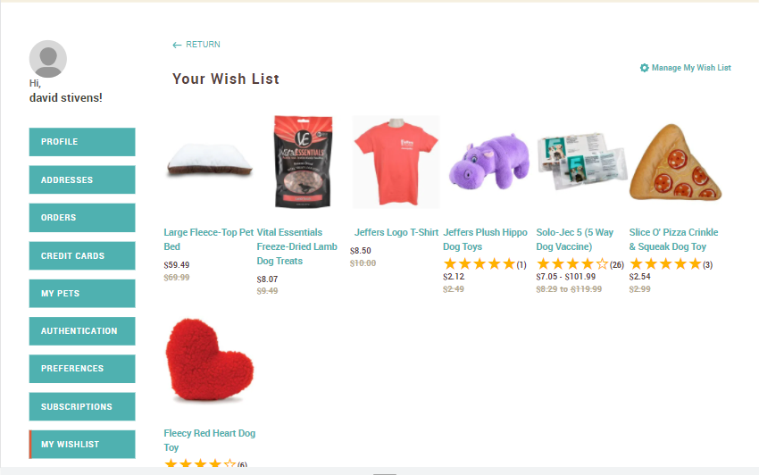
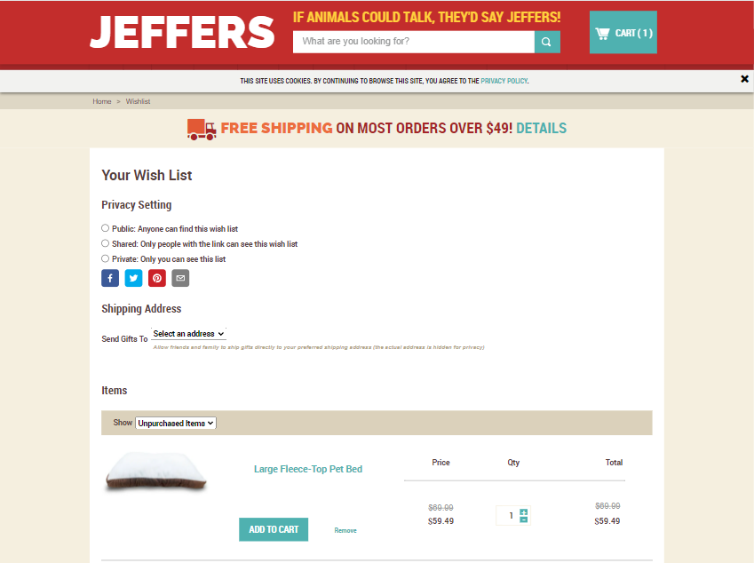
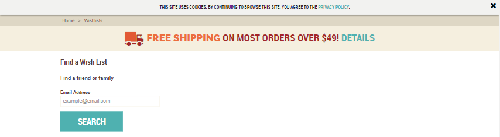

📢 Use this project, [contribute](https://github.com/{OrganizationName}/{AppName}) to it or open issues to help evolve it using [Store Discussion](https://github.com/vtex-apps/store-discussion).

# Wish List Jefferspet

This wishlist aplication allow to the user save a product what like for in a future can buying this and don't lost trail to the product in your account

## Pseudocode of the app
### Wishlist App it's constructed for some components, as the following: 

**Add Mesagge**: this is a pop up what the said to the user what your product it's successfully saved.  

**Lisening To Wishtlist**: this component it shows if you have prodcuts added into your wish lilst, you only can added 10 products.

**find wishlist**: if any friends or family members have a wish list, you can find their wisht list by email.

**List Item**: render all items what you have added into your wish list. 

**TotalPrice**: indicates the price about all your products into the wish list

**wishlist**: configuration to share your wishlist in social media and allows too find family members and friends.

**wishShare**: allow share your wishlist

**wishSelector**:you can see the Unpurchased Item and pruchased item too.  

## Screen Shots 

## CCS Handles

| **Add Mesagge** |
| ----------- |
| 	`addMessage__container`     |
| `addMessage__content`     |
| `addMessage__text`     |
| `addMessage__link`     |
|`addMessage__close` |

| **Lisening To Wishtlist** |
| ----------- |
| 	`wrapperWishList`     |
| `wrapperWishListButton`     |
| `viewWishlist`     |

| **find wishlist** |
| ----------- |
| 	`button`     |
| `text_box`     |
| `text`     |
| `sub_title`     |
|`container` |
|`property` |
|`product_list` |

|**List Item**|
| ----------- |
| 	`product_list_item`     |
| `product_list_cell`     |
| `media`     |
| `link_image`     |
|`image` |
|`info` |
|`summary_line_item` |
|`name` |
|`link_name` |
|`button` |

|**TotalPrice** |
| ----------- |
| 	`total_price_wrapper`     |

|**wishlist**|
| ----------- |
| 	`wishlist_link_wrapper`    |
| 	`wishlist_link_p`    |
| 	``wishlist_link``    |
| 	``container``    |
| 	`privacy_options_wrapper`    |
| 	`privacy_options`    |
| 	`share_button`    |
| 	`wishlist_icon`    |
| 	`wishlist_h4`    |
| 	`gifts_wrapper`    |
| 	`gifts_select`    |
| 	`gifts_span_msg`    |
| 	`radio_input`    |
| 	`product_list`    |
| 	`wishlist_link_wrapper`    |

|**wishShare**|
| ----------- |
| 	`container`    |
| 	`product_list`    |

|**wishSelector**|
| ----------- |
| 	`selector_main_wrapper`    |
| 	`label_selector`    |
| 	`wishlist_selector`    |

## Master Data entities

| Master data Entities |
| -------------------- |
| `XXXXX`              |
| `XXXXX`              |
| `XXXXX`              |
| `XXXXX`              |
| `XXXXX`              |

## Required VTEX Dependencies

You must installer **"vtex.wish-list": "1.x"** 

	
		

